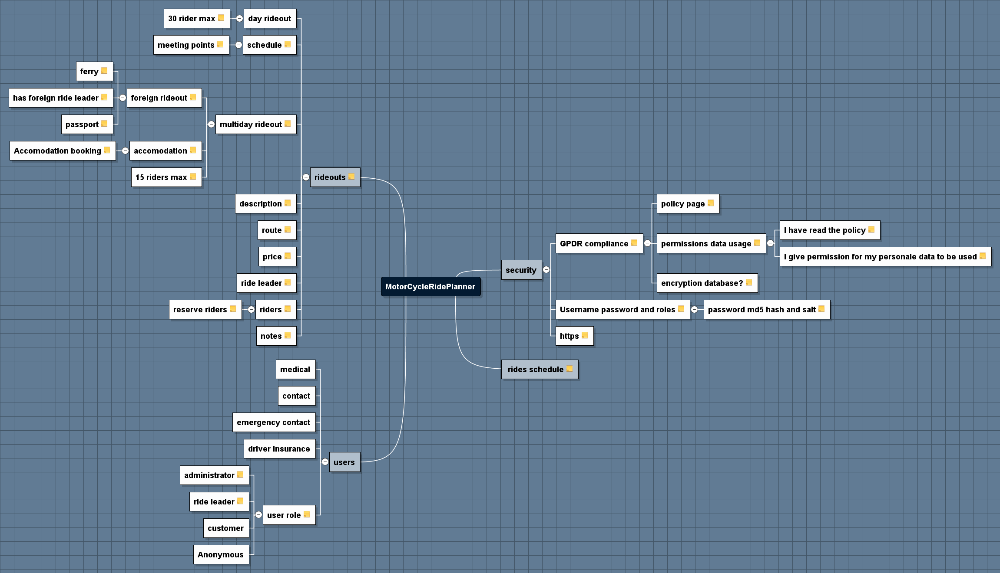

<!--
Generated by NB Mind Map Plugin (https://github.com/raydac/netbeans-mmd-plugin)
2019-01-31
-->
# MotorCycleRidePlanner

This list of features describe the contents of the Mind Map generated by the Netbeans Mind map plugin.

## rideouts
<pre>Rideouts are organised excursions of a group of motorcyclists.
These excursions are organised centrally by the motorcycle shop and subscribed to by motorcyclists
registered with the shop.

</pre>

### day rideout
<pre>Day rideouts usually begin and end near the motorcycle shop and are simpler to administer.
More riders can go on a day rideout.</pre>

#### 30 rider max
<pre>day rideouts usually only have a maximum of 30 riders including leader</pre>

### schedule
<pre>A schedule of day by day activates and accommodation stopovers etc is provided</pre>

#### meeting points
<pre>A scheduled stopping point list is provided</pre>

### multiday rideout
<pre>Ridouts may occur over multiple days
In this case accommodation and daily schedules are provided for each dayt</pre>

#### foreign rideout
<pre>Foreign ridouts are excursions to continental europe and require extra planning</pre>

##### ferry
<pre>Foreign rideouts will involve a ferry booking for he riders</pre>

##### has foreign ride leader
<pre>Foreign rides must have ride leaders with experience of the country
Ride leaders populate the ride information and schedule</pre>

##### passport
<pre>All foreign riders must have a valid passport or visa for countries being entered</pre>

#### accomodation
<pre>Multi day rideouts will include accomodation</pre>

##### Accomodation booking
<pre>accommodation must be booked in advance</pre>

#### 15 riders max
<pre>Typically multi day rideounts are limited to 15 including the ride leaders</pre>

### description
<pre>A public description of the ride is provided</pre>

### route
<pre>A GPS readable waypoint schedule is provided</pre>

### price
<pre>All rides have a price for participation. 
Payment collection is out of scope.</pre>

### ride leader
<pre>All rides must have at least one ride leader. 
Additional ride leaders can also be appointed (deputy)
Ride leaders can mange the ride schedule and plan the ride</pre>

### riders
<pre>All rides have ride members who have registered for the ride. 
Ride members must have paid in order to participate</pre>

#### reserve riders
<pre>A reserve list of riders in possible if he ride is oversubscribed</pre>

### notes
<pre>A notes section is provided for internal notes about ride progress</pre>

## users
<pre>Users have basic information and roles which determine what 
actions they can perform on the site.</pre>

### medical
<pre>All riders must have medical insurance and provide a GP contact details.
All riders must supply any details of medical conditions which
the  drive leader needs to know about</pre>

### contact
<pre>All ricers must provide basic contact details;
name, address, postcode, fixed and mobile phone numbers, 
alternative phone numbers if abroad</pre>

### emergency contact
<pre>All riders must provide an emergency contact</pre>

### driver insurance
<pre>All drivers on a ridout must have insurance. 
Evidence of Insurance must be seen verified by shop staff or ride leaders.
Insurance is associated with the motorcyclist and not the motorcycle.</pre>

### user role
<pre>All users will have an allocated list of roles</pre>

#### administrator
<pre>Site admin has access to all areas</pre>

#### ride leader
<pre>Ride leaders have access to rides to which they are allocated</pre>

#### rider
<pre>The users who are riders have basic rights to apply to register for a ride
and view rides on which they are registered.</pre>

#### Anonymous
<pre>Anonymous users can view basic web site details, 
list upcoming rideouts
register with the site and apply for a rideout</pre>

## Non Functional Requirements
<pre>The system has a basic set of non functional requirements with which it must conform</pre>

### run in the cloud

### deployable as java web app \(war\)

### built using standard java technology

### use a layered architecture

#### web layer

#### service layer

#### use a persistence DAO layer

#### client scripting layer

### use a standard build and test framework

## data security
<pre>The system must exhibit good data security and best practice for handing customer data</pre>

### GPDR compliance
<pre>The site must be designed to enforce generally applicable good practice for GPDR compliance</pre>

#### policy page
<pre>The companies data handling policy page should be assessable on the website and particularly 
highlighted when the user is registered.</pre>

#### permissions data usage
<pre>Users must explicitly give permissions for their data to be used as per the Data Policy Page
Users will not be allowed to register onthis site unless permission is given.</pre>

##### I have read the policy
<pre>Users registeing must indicate they have read the policy</pre>

##### I give permission for my personal data to be used
<pre>Users registering must give permissions including.
Permission to share with other riders and ride leader
Permission to contact you by email or phone about he rideouts on which you have registered.
Permission to send limited marketing information about future rideouts.
</pre>

#### encryption database?
<pre>As a stretch objetive, personally identifiable information should be encrypted in the database</pre>

### Username password and roles
<pre>Users must have unique usernames and passwords.
Login determines which roles the user is assigned. 
User roles should be included in the Session object for use by pages and ReST interface to determine valid requests</pre>

#### password md5 hash and salt
<pre>Passwords must be saved encrypted using a MD5 hash and Salt in the database</pre>

### https
<pre>All communications to the web site must be secured using HTTPS
URL request encoding must not be used for secure communications such as passwords etc (use POST).</pre>

##  rides schedule
<pre>Anonymous Site users can see a list of future planned rideouts and can select a rideout for more information 
and to begin registration process
</pre>
