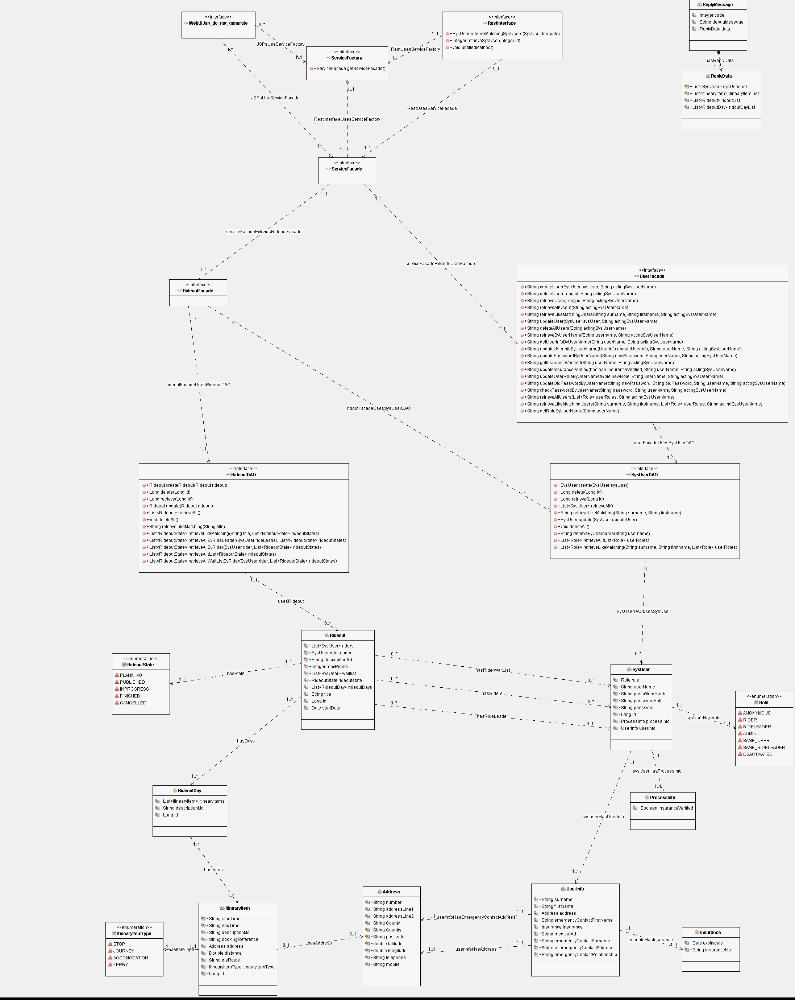

# Draw IO

You will be constructing our use cases using Draw IO

Draw IO (https://www.draw.io/) is a simple on line javascript based drawing library which can construct UML diagrams in your browser. 
Images can be saved and loaded as xml files within your project and exported as images which can be included in your documentation.

# Design Diagrams

# Information Model

# Class Diagram

## Use case diagram

## MotorCycleRide Planner Page Flow 

## MotorCycleRidePlanner Robustness Diagram 

